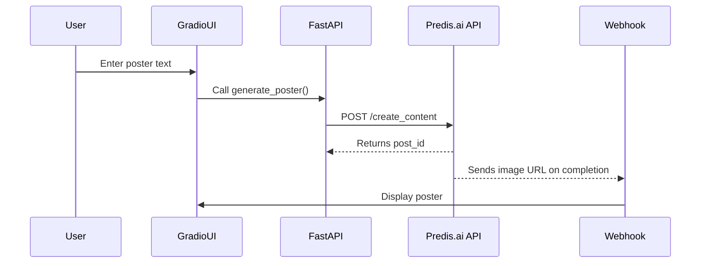

# 🎨 Predis.ai Poster Generator

A **FastAPI + Gradio** based app to generate **AI-powered posters** using the [Predis.ai API](https://predis.ai).

This tool lets you:

* Enter any poster text.
* Generate a **high-quality poster** using Predis.ai.
* Host a **webhook** to receive completed images.
* Run on your local machine or server.

---

## 🚀 Features

* **Automated** poster generation via Predis.ai.
* **Webhook support** for real-time poster delivery.
* **Gradio UI** for easy user interaction.

---

## 🛠️ Installation

### 1️⃣ Clone the repo

```bash
git clone https://github.com/<your-username>/predis-poster-generator.git
cd predis-poster-generator
```

### 2️⃣ Install dependencies

```bash
pip install -r requirements.txt
```

**`requirements.txt`**

```
fastapi
gradio
requests
```

---

## 🔑 Set up Predis API

1. Get your **Predis.ai API key** from [https://predis.ai](https://predis.ai).
2. Find your `brand_id` in the Predis dashboard.
3. Replace them in `app.py`:

   ```python
   API_KEY = "your-api-key"
   BRAND_ID = "your-brand-id"
   ```

---

## ▶️ Run the app

```bash
uvicorn app:app --reload
```

Your app will run at:
👉 **[http://127.0.0.1:8000/ui](http://127.0.0.1:8000/ui)**

---

## 📸 Screenshot

Below is an example screenshot of the app in action:


> 🖼️ **Note:** Place your screenshot in the root of the repo and name it `screenshot.png` (or update the path in the README).

---

## 📜 How it works

1. Enter poster text in the Gradio UI.
2. `generate_poster()` triggers the Predis.ai `create_content` API.
3. The app waits for the webhook callback:

   * ✅ If completed → Displays generated image.
   * ❌ If error → Shows error message.

---

## 📡 API Flow



## 📜 License

MIT License © 2025
